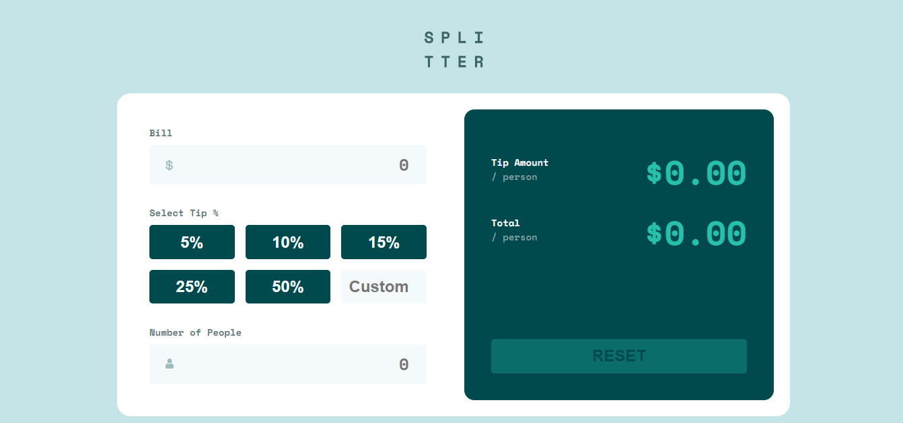

# Tip Calculator App

This is a solution to the Tip Calculator App challenge on Frontend Mentor. It is a responsive web application that allows users to calculate the tip amount and total cost per person easily.

---

## Table of Contents

- [Overview](#overview)
  - [The Challenge](#the-challenge)
  - [Screenshot](#screenshot)
  - [Links](#links)
- [My Process](#my-process)
  - [Built With](#built-with)
  - [What I Learned](#what-i-learned)
  - [Continued Development](#continued-development)
- [Author](#author)

---

## Overview

### The Challenge

Users should be able to:

- Enter the bill amount
- Select or enter a custom tip percentage
- Enter the number of people
- Calculate:
  - Tip amount per person
  - Total amount per person
- See validation (e.g., number of people can't be zero)
- View responsive layout for different screen sizes
- See hover and interactive states

---

### Screenshot

---

### Links

- 🔗 Repository:  
  https://github.com/IrfanAnsari21/tip-calculator-app.git  

- 🌐 Live Site:  
  https://frontendmentor-tipcalculator-app.netlify.app/

---

## My Process

### Built With

- Semantic HTML5
- CSS (Flexbox / Grid / Responsive Design)
- JavaScript (DOM Manipulation & logic handling)
- Mobile-first workflow

---

### What I Learned

- Handling user input and form validation
- DOM manipulation using JavaScript
- Performing real-time calculations
- Managing edge cases like division by zero
- Improving UI responsiveness and user experience

---

### Continued Development

- Improve UI design to match design pixel-perfectly
- Add better error handling and user feedback
- Optimize code structure and reusability
- Enhance accessibility

---

## Author

- GitHub:  
  https://github.com/IrfanAnsari21  

- Frontend Mentor:  
  https://www.frontendmentor.io/profile/IrfanAnsari21

---

## ⭐ Acknowledgments

Thanks to **Frontend Mentor** for providing this challenge to improve real-world frontend skills.